<p align="center">
  
</p>

<p align="center"><a href="README.md">English</a> · <a href="README.it.md">Italiano</a></p>

<p align="center">
  
  
  
  
  
</p>

> Un ambiente di studio bilingue e pratico per CompTIA Security+ SY0-701, con obiettivi strutturati, scenari realistici e un trainer di cybersecurity assistito dall’IA.

<p align="center"><a href="https://comp-tia-security-sy-0-701.vercel.app"><strong>Live demo</strong></a> · <a href="https://github.com/chiaraberti13/CompTIA-Security-SY0-701/issues">Report an issue</a></p>

---

## Navigazione rapida

- **[Cos'è](#cosè)** — L'idea dietro il trainer e come è strutturato.
- **[Funzionalità](#funzionalità)** — Checklist, glossario, simulatore d'esame, trainer AI.
- **[Prerequisiti](#prerequisiti)** — Cosa serve installare prima di iniziare.
- **[Chiave API Gemini](#chiave-api-gemini)** — Come ottenere la chiave gratuita usata dall'AI.
- **[Variabili d'ambiente](#variabili-dambiente)** — Il file `.env` letto dall'applicazione.
- **[Installazione](#installazione)** — Passo-passo per Linux, macOS e Windows.
- **[Script](#script)** — I comandi npm e cosa fa ciascuno.
- **[Architettura](#architettura)** — Dove vive il codice nel repository.
- **[Risoluzione dei problemi](#risoluzione-dei-problemi)** — I due errori più probabili e come risolverli.
- **[Licenza](#licenza)** — MIT per il codice; i marchi CompTIA restano dei rispettivi proprietari.

> [!TIP]
> **Hai trovato un errore in una domanda o in una traduzione, o hai un'idea?** Apri una [issue](https://github.com/chiaraberti13/CompTIA-Security-SY0-701/issues) — bilingue, self-hosted e privacy-first è l'unico vero requisito.

---

## Cos'è

Un'unica app web self-hosted per prepararsi all'esame **CompTIA Security+ SY0-701**. Gira
interamente sulla tua macchina o sul tuo server: il frontend React è servito da un piccolo
backend Express che funge anche da proxy verso l'API di Google Gemini, così la tua API key
resta lato server e non viene mai inviata al browser.

Tutto nell'app è **bilingue**. L'italiano è la fonte di verità (`src/data.ts`) e l'inglese è
un overlay a chiavi (`src/data.en.ts`) che ricade sull'italiano per ciò che non è ancora
tradotto, il tutto collegato da `src/localizedData.ts` — i subtopic e le domande di quiz di
tutti e cinque i domini sono pienamente disponibili in entrambe le lingue.

La filosofia, condivisa con gli altri repository:

- **Self-hosted** — nessun account di terze parti per l'app stessa; clona ed esegui.
- **Privacy-first** — la tua chiave Gemini vive in un `.env` locale ed è usata solo dal tuo
  server; nulla dei tuoi dati di studio lascia la tua macchina.
- **Gratuito e open-source**, sotto licenza MIT.

## Funzionalità

- **Checklist interattiva SY0-701** — traccia i progressi su tutti i 5 domini ufficiali
  (General Security Concepts; Threats, Vulnerabilities & Mitigations; Security Architecture;
  Security Operations; Security Program Management & Oversight).
- **Glossario completo SY0-701** — ricerca istantanea con filtri per dominio e categoria
  (acronimi, controlli, attacchi, metriche/formule, governance), indice A–Z e segnalibri.
- **Trainer AI Senior di Cybersecurity** — basato sull'**API Google Gemini** per
  spiegazioni passo-passo, confronti concettuali e chiarimenti sulle metriche d'esame
  (ALE, SLE, ARO, RTO, RPO e altre).
- **Simulatore d'esame high-stakes** — domande basate su scenari di livello
  Analisi/Applicazione con motivazioni dettagliate e analisi dei distrattori.
- **Generatore AI di domande di recupero** — dopo una sessione di pratica, l'AI genera
  dinamicamente domande mirate sugli argomenti dove sei stato più debole.
- **Localizzazione completa Inglese / Italiano** — ogni subtopic e domanda di quiz in
  entrambe le lingue, commutabile nell'app.

## Prerequisiti

- **Node.js** `18.x` o superiore (consigliata LTS `20.x` / `22.x`).
- **npm** `9.x` o superiore (incluso con Node.js).
- **Git** — per clonare il repository.

## Chiave API Gemini

Il trainer AI e il generatore di domande di recupero usano l'SDK ufficiale `@google/genai` e
richiedono una **`GEMINI_API_KEY`** gratuita:

1. Vai su **Google AI Studio**: <https://aistudio.google.com/>
2. Accedi con il tuo account Google.
3. Clicca **"Get API key"**.
4. Clicca **"Create API key"** (scegli un progetto Google Cloud nuovo o esistente).
5. Copia la stringa generata (es. `AIzaSy...`) — andrà nel file `.env`.

## Variabili d'ambiente

Copia `.env.example` in un nuovo file chiamato `.env` nella radice del progetto:

```env
# Obbligatoria — Trainer AI Google Gemini e motore di recupero
GEMINI_API_KEY="Incolla_Qui_La_Tua_Chiave_Gemini"

# Opzionale — URL base dell'applicazione
APP_URL="http://localhost:3000"
```

> [!WARNING]
> Non committare mai il file `.env` su un repository pubblico — contiene una credenziale API privata.

## Installazione

### 🐧 Linux (Ubuntu, Debian, Fedora, Arch)

```bash
# 1. Installa i prerequisiti
# Ubuntu / Debian:
sudo apt update && sudo apt install -y curl git
curl -fsSL https://deb.nodesource.com/setup_20.x | sudo -E bash -
sudo apt install -y nodejs
# Fedora / RHEL:   sudo dnf install -y git nodejs
# Arch:            sudo pacman -S git nodejs npm

# 2. Verifica
node -v   # v18.x.x o superiore
npm -v    # v9.x.x o superiore

# 3. Clona, installa, configura
git clone https://github.com/chiaraberti13/CompTIA-Security-SY0-701.git
cd CompTIA-Security-SY0-701
npm install
cp .env.example .env
nano .env          # incolla la tua GEMINI_API_KEY

# 4. Avvia
npm run dev        # sviluppo, hot reload → http://localhost:3000
# oppure
npm run build && npm start   # produzione
```

### 🍎 macOS (Intel & Apple Silicon)

```bash
# 1. Installa i prerequisiti (Homebrew)
/bin/bash -c "$(curl -fsSL https://raw.githubusercontent.com/Homebrew/install/HEAD/install.sh)"
brew install node git

# 2. Clona, installa, configura
cd ~/Documents
git clone https://github.com/chiaraberti13/CompTIA-Security-SY0-701.git
cd CompTIA-Security-SY0-701
npm install
cp .env.example .env
nano .env          # incolla la tua GEMINI_API_KEY (CTRL+O, INVIO, CTRL+X)

# 3. Avvia
npm run dev                    # → http://localhost:3000
# oppure
npm run build && npm start
```

### 🪟 Windows (PowerShell / CMD / WSL2)

**Nativo (PowerShell come Amministratore):**

```powershell
# 1. Installa i prerequisiti
winget install OpenJS.NodeJS.LTS
winget install Git.Git
# (riavvia il terminale dopo)

# 2. Clona, installa, configura
cd $HOME\Documents
git clone https://github.com/chiaraberti13/CompTIA-Security-SY0-701.git
cd CompTIA-Security-SY0-701
npm install
Copy-Item .env.example .env
notepad .env       # incolla la tua GEMINI_API_KEY, poi salva

# 3. Avvia
npm run dev                    # → http://localhost:3000
# oppure
npm run build ; npm start
```

**WSL2:** apri la shell WSL (es. Ubuntu) e segui i passi Linux qui sopra — l'app risponde su
`http://localhost:3000` anche nel browser di Windows.

## Script

| Comando | Cosa fa |
| :--- | :--- |
| `npm run dev` | Express + middleware Vite in sviluppo, hot reload su `http://localhost:3000`. |
| `npm run build` | Compila il frontend React (Vite) e impacchetta il backend Express (esbuild) in `dist/server.cjs`. |
| `npm start` | Avvia il server compilato in produzione (`node dist/server.cjs`). |
| `npm run lint` | Controllo dei tipi TypeScript (`tsc --noEmit`). |
| `npm run clean` | Rimuove gli artefatti di build (`dist`, `server.js`). |

## Architettura

Struttura **full-stack** integrata — un unico server Express serve il frontend e fa da proxy a Gemini:

```
├── server.ts                 # Server Express & proxy API Gemini
├── src/
│   ├── App.tsx               # Componente React principale (Studio, Glossario, Quiz, AI)
│   ├── components/           # Sezioni UI (es. Glossario con ricerca e filtri)
│   ├── main.tsx              # Entry point React 19
│   ├── data.ts               # Fonte di verità italiana — 5 domini & banca domande
│   ├── data.en.ts            # Overlay inglese (ricade sull'italiano)
│   ├── localizedData.ts      # Unisce le due lingue
│   ├── i18n.tsx              # Localizzazione stringhe UI & cambio lingua
│   ├── types.ts              # Interfacce TypeScript
│   └── index.css             # Stili Tailwind CSS v4
├── .env.example              # Modello per le variabili d'ambiente
├── package.json              # Dipendenze & script
├── vite.config.ts            # Configurazione Vite
└── tsconfig.json             # Configurazione TypeScript
```

## Risoluzione dei problemi

**Errore AI: _"GEMINI_API_KEY non configurata"_**
`.env` mancante o chiave non valida. Assicurati che `.env` esista nella radice del progetto
con una chiave valida da Google AI Studio, poi riavvia il server (`npm run dev`).

**`Error: listen EADDRINUSE: address already in use :::3000`**
La porta 3000 è occupata. Liberala:
- **Linux / macOS:** `npx kill-port 3000`
- **Windows PowerShell:** `Get-Process -Id (Get-NetTCPConnection -LocalPort 3000).OwningProcess | Stop-Process`

## Licenza

Il codice di questo repository è distribuito sotto **licenza MIT** — vedi
[`LICENSE`](LICENSE) per il testo completo. Sei libero di usarlo, studiarlo, modificarlo e
ridistribuirlo, anche commercialmente, purché venga mantenuta la nota di copyright; è fornito
"così com'è", senza garanzie.

Questo progetto è un ausilio allo studio indipendente e a scopo educativo. **CompTIA** e
**Security+** sono marchi registrati di CompTIA, Inc.; questo progetto non è affiliato né
approvato da CompTIA, e tali marchi appartengono ai rispettivi proprietari.

---

<p align="center">
  <sub>Realizzato con 🛡️ da <a href="https://github.com/chiaraberti13">chiaraberti13</a></sub>
</p>

---
